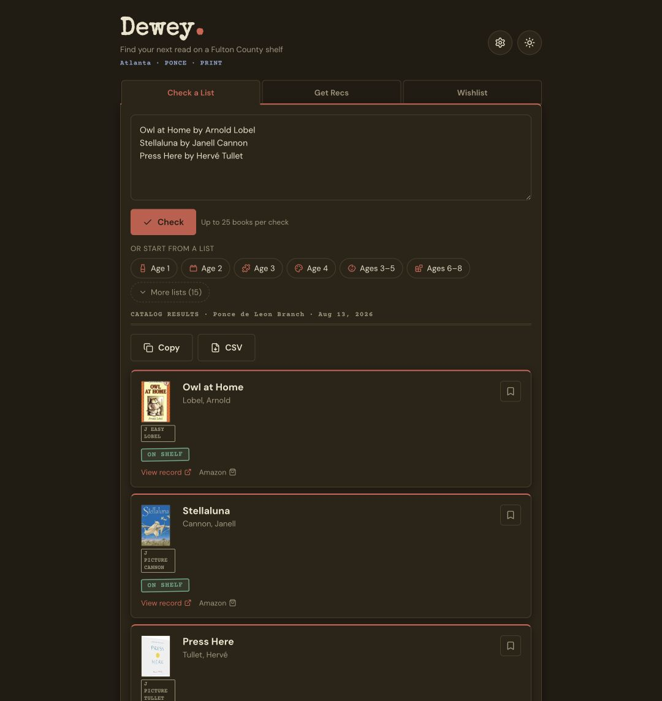

# Dewey

Dewey turns a reading list into a practical library trip. Paste up to 25 books—or ask for recommendations—choose a supported library system and branch, and see live shelf availability and call numbers.

Currently supports the listed library systems using BiblioCommons, plus the DeKalb County Public Library Polaris catalog in beta (print titles only).

[Try Dewey](https://deweybooks.vercel.app) · [Read the project story](https://dimadimadima.com/projects/dewey)



## What it does

- Checks a whole reading list against a selected library branch.
- Shows on-shelf, checked-out, and uncertain-match states with call numbers.
- Generates book recommendations and verifies them against the catalog.
- Saves a local wishlist without requiring an account.
- Includes generic age-band and topic starter lists.
- Finds nearby Fulton and DeKalb branches by ZIP, city, address, branch name, or an explicit one-time location request.

The model recommends. The library catalog verifies. When the match is uncertain, Dewey says so instead of presenting a guess as fact.

## How it works

Dewey is a Next.js application. A library-system registry dispatches server-side availability checks to a normalized provider adapter. Fulton and the other supported systems use the same BiblioCommons JSON gateway as their public catalogs. The DeKalb preview uses a logged-out, read-only Polaris catalog session and supports print books only. Both paths apply title and author matching before returning availability to the browser. Recommendation requests use OpenRouter; the OpenRouter credential remains server-side.

Both public catalog integrations are unofficial and may change. Dewey is an independent community project and is not affiliated with or endorsed by Fulton County Library System, DeKalb County Public Library, BiblioCommons, or Polaris.

## Local development

Requirements: Node.js 20 or newer and npm.

```bash
npm ci
cp .env.example .env.local
npm run dev
```

Open `http://localhost:3000`.

Provider verification:

```bash
npm run test:polaris
npm run test:polaris:live
```

The live check is read-only and uses generic published titles against DeKalb's logged-out catalog.

Branch-location data comes from the two library systems' official public location pages. Refresh and validate the bundled file with:

```bash
node scripts/refresh-branch-locations.mjs
npm test
```

Environment variables:

- `OPENROUTER_API_KEY` — server-only credential for recommendations. Availability checks work without it.
- `NEXT_PUBLIC_POSTHOG_KEY` — optional public PostHog project token for the intentionally instrumented funnel events.

Never prefix the OpenRouter key with `NEXT_PUBLIC_` or commit `.env.local`.

## Privacy and analytics

Dewey does not require an account. Wishlist data stays in the browser's local storage. Location access is never requested automatically. If a visitor chooses “Use my location,” precise coordinates are used only in that browser session to rank nearby branches and are not sent to Dewey's server or analytics.

When PostHog is configured, Dewey records only explicit product events such as search started/completed, result count, selected branch, search mode, recommendation completion, and the project-story click. It does not send pasted book-list text or recommendation prompts to analytics. Recommendation prompts are sent to OpenRouter to generate the requested results, so users should not enter names or personal information.

## Cost and abuse controls

The prototype includes request limits, but its in-memory counters reset across deployments and server instances. Before broad promotion, use a Dewey-specific OpenRouter key with provider-enforced spend limits and replace or supplement the prototype limiter with durable abuse protection.

## Contributing and security

Bug reports and focused pull requests are welcome. Do not include patron information, API keys, personal reading data, or other private content in issues or test fixtures. Run `npm run lint` and `npm run build` before submitting a change.

Please report vulnerabilities privately as described in [SECURITY.md](SECURITY.md).

## Attribution and license

Built by [Dima Perkis](https://dimadimadima.com/projects/dewey).

The source is available under the MIT License. See [LICENSE](LICENSE).
